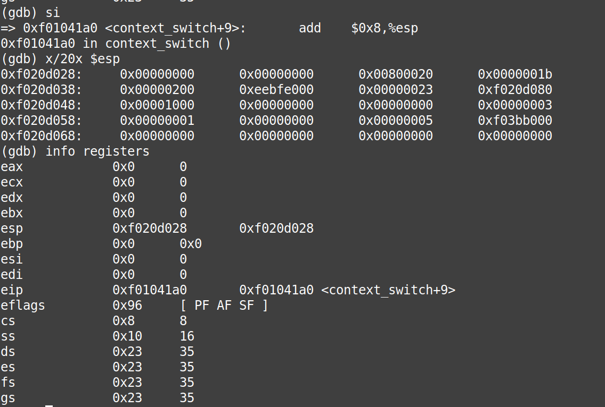

# sched

Lugar para respuestas en prosa, seguimientos con GDB y documentación del TP.

## Parte 1 - cambio de contexto con GDB

> [!NOTE]
> En caso de que no se vean las imágenes, ver el archivo `dumps.md` en la carpeta informe.

Paso por paso:

### Paso 1

Ponemos un _breakpoint_ en `context_switch`. En este momento estamos en el _ring_ 0.

Vemos el stack al inicio de `context_switch`.

### Paso 2

Estamos a punto de modificar el puntero de la pila para poder restaurar el _trapframe_. 

### Paso 3

Aquí vemos que el contenido de `%esp` cambió, ahora apunta al _trapframe_. En el próximo paso haremos `popal` para restaurarlo.

También vemos que el contenido de `cs`, `0x8` (`1000` en base 2) indica que estamos en el _ring_ 0 o modo _kernel_, como se mencionó en el paso 1.

### Paso 4

Vemos que se han modificado los registros `%eax`, `%ebx`, `%ecx`, `%edx`, `%esi`, `%edi` y `%ebp`, lo que significa que restauramos el estado de ese proceso (o del procesador) al momento que fue interrumpido.

### Pasos 5 y 6

Se restauran los registros `%es` y `%ds`.

### Paso 7

Antes de hacer `iret`.

### Paso 8

Luego de salir de `context_switch` por haber ejecutado `iret` vemos que el contenido de `cs` es `0x1b` (`1 1011` en base 2) es decir estamos en el _ring_ 3 que es el de usuario, ergo hemos cambiado de modo _kernel_ a modo usuario.

## Parte 3: Scheduler con prioridades

En líneas generales, la idea de un Scheduler con prioridades es la de asignar prioridades a cada proceso que sea Runnable, la cual determina en cierta forma el orden de ejecución de dicho proceso. En este trabajo práctico se implementó un MLFQ, previniendo el deadlock de procesos con menor prioridad que otros manipulando internamente las prioridades de los procesos.

En nuestro caso decidimos que cada proceso tengo una prioridad inicial de 5 al momento de ser inicializado; donde rango de prioridades que pueden tomar es de 1 a 10.
El algoritmo de manipulación de prioridades funciona de la siguiente manera:

• Se busca el proceso que pueda ser ejecutado (Runnable) que tenga mayor prioridad.

Para aquellos procesos que no fueron seleccionados, se incrementa si prioridad para que tarde o temprano se pueda ejecutar.

• Se ejecuta el proceso seleccionado.

• En caso de que no haya un proceso Runnable, se corre el Running.

• Por ultimo si no hay nada mas que hacer, se invoca a sched_halt().
